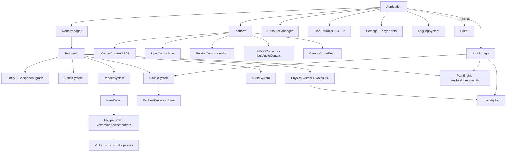

# Voxagine architecture map

This document describes the reviewed architecture at revision `743c4c67331b10bf7b7d732f78dedc9c9e2215d4`. Paths and symbols are intended as durable navigation keys; use `source-manifest.jsonl` to locate later moves.

## System shape

Voxagine is a C++17 engine and game executable built around five cooperating layers:

1. `Application` owns process-level services and the main loop.
2. `Platform` selects window, input, rendering, audio, ImGui, and timer implementations.
3. `WorldManager` owns a stack of `World` objects and applies deferred world changes at a GPU-safe point.
4. Each `World` owns entities plus script, physics, audio, chunk, pathfinding-facing, and rendering systems.
5. The optional editor wraps the same world/runtime services with an editor world, hierarchy, inspector, property reflection, asset views, and undo/redo.

The primary composition root is `Application::Run` in `Voxagine/Source/Core/Application.cpp`. The primary world composition root is `World::Initialize` in `Voxagine/Source/Core/ECS/World.cpp`.

## Process lifecycle

`Application::Run` performs startup in this order:

1. Construct and initialize `PosixFileSystem` or `ORBFileSystem`.
2. Initialize logging.
3. attach the filesystem to `JsonSerializer`.
4. Load `Settings.vgs`, or write defaults if generic deserialization reports failure.
5. Initialize `JobManager` worker threads.
6. Initialize `Platform`, which constructs timers, SDL window/input, Vulkan render context, ImGui, and FMOD or the null-audio fallback.
7. invoke game-specific `OnCreate`.
8. initialize the editor in `EDITOR` builds.
9. reset variable and fixed timers, then enter the frame loop.

The current shutdown order is game `OnExit`, job-manager deinitialization, logging deinitialization, editor teardown, world clearing, resource unloading, platform teardown, and filesystem deletion. This order is a central review concern: worlds, systems, and editor objects are torn down after jobs and logging even though their destructors/unload paths use those services. See `VX-LIFE-001` and `VX-JOB-002`.

### Main-frame sequence

Within the variable timer callback, a frame proceeds as follows:

1. If deferred world operations exist, wait for the GPU and call `WorldManager::SwapWorlds`.
2. Poll the window.
3. update input and ImGui.
4. clear the render context.
5. invoke application/game `OnUpdate`.
6. run `JobManager::ProcessFinishedJobs` on the main thread.
7. run world pre-tick and tick (directly or through editor wrappers).
8. advance the fixed timer; each callback runs world fixed and post-fixed ticks.
9. run world post-tick.
10. copy the main camera matrices/position into `RenderContext` when a camera exists.
11. perform world rendering/gizmos, editor rendering, and application `OnDraw`.
12. call `RenderContext::Present`.

World loads, pushes, and pops are queued and only applied at step 1. This avoids mutating the world stack during entity/system iteration, but queued callbacks still need empty-stack guards and explicit ownership.

### Fixed-step semantics

`ChronoGameTimer` can consume multiple elapsed fixed intervals in one update, but its implementation advances the counters multiple times and invokes the callback once after the loop. That means elapsed simulation time and executed simulation steps can diverge after a stall. See `VX-TIME-001`.

## Ownership and lifetime model

The codebase predominantly uses raw owning pointers and synchronous destruction:

| Owner | Owned objects | Destruction route |
| --- | --- | --- |
| `Application` | world manager, platform, resources, serializer, settings, logging, jobs, optional editor; raw filesystem | members plus explicit `Run` teardown |
| `WorldManager` | stack of `World*` | `ClearWorlds`, `LoadWorld`, `PopWorld` call `World::Unload`, then `delete` |
| `World` | `Entity*`, `ComponentSystem*`, separate `RenderSystem*`, job-queue handle | `World::Unload` stages/destroys entities, deletes systems, discards queue |
| `Entity` | `Component*` and transform | entity destructor deletes active and staged components |
| `ReferenceManager<T>` | cached `ReferenceObject` subclasses | reference count reaches zero and a release event synchronously deletes/removes it |
| `JobManager` | `JobThread*`, `JobQueue*`, pending/finished `Job*` | explicit deinitialize/discard paths |
| `Editor` | views, editor world/camera, textures, command history | explicit `UnInitialize` and member destructors |

Important invariants are implicit rather than type-enforced:

- A job that captures an object must finish or become incapable of touching that object before destruction.
- A world must keep its job queue and the global job manager alive until every world/system cancellation path has completed.
- Resources must be unloaded while their rendering/audio backend is still live.
- Event subscribers must unsubscribe before their callback target becomes invalid.
- Undo commands must not outlive their raw entity/component/world targets.

These invariants are currently violated in several paths. The architecture would benefit from explicit shutdown phases, joinable cancellation tokens, RAII subscriptions, and smart/handle-based ownership at asynchronous boundaries.

## Threading model

`JobManager` creates a set of polling `JobThread` workers. Producers enqueue `Job` objects into named `JobQueue` instances; workers scan queues and call `Job::Run`. Finished work is transferred to a main-thread collection, and `ProcessFinishedJobs` invokes `Finish` and deletes the job. Queues can be shelved/un-shelved or discarded.

Intended split:

- Worker thread: expensive calculation in `Run`.
- Main thread: engine mutation and callbacks in `Finish`.
- Cancellation: `Canceled` requests that long-running `Run` stop.

Observed consumers include world loading, chunk load/unload and voxel baking, pathfinding grid phases, file reads, and physics integrity calculations. Most callbacks capture raw `this`, raw entity/system pointers, or references into vectors. There is no global lifetime token tying those captures to world/system ownership. Job queues reduce routing ambiguity but do not themselves join all work before the object graph is deleted.

The current implementation polls at 10 ms rather than waiting on a condition variable. Queue lookup/logging collections also have unsynchronized readers/writers. See all `job-system`, `logging`, `chunks`, `pathfinding`, and `physics` concurrency records in `findings.jsonl`.

## ECS and world model

`World` uses staged mutation:

- active entities are in `m_Entities`;
- newly added entities are in `m_AddedEntities` until `PreTick`;
- removed entities are in `m_RemovedEntities` until the next `PreTick`;
- entities similarly stage added/removed components.

This is the right broad strategy for avoiding iterator invalidation during ticks. `World::PreTick` deletes pending entities, activates new entities, applies component changes, and asks the serializer to resolve deferred world links.

Core systems:

- `ScriptSystem` updates behavior scripts, routines, and delegates.
- `PhysicsSystem` integrates bodies/colliders and applies voxel destruction through `VoxelGrid`.
- `AudioSystem` maps `AudioSource` components to platform channels and manages BGM transitions.
- `ChunkSystem` maintains near-field voxel chunks around viewers and the far-field level representation.
- `RenderSystem` gathers voxel, sprite, particle, text, UI, and debug data for `RenderContext`.
- Pathfinding is represented by world entities/components such as `ChunkGrid`, `PathfinderGroup`, `ContinuumCrowdsGroup`, `Pathfinder`, and `PathfindingObstacle`; it dispatches its own jobs through the world queue.

Entity hierarchy is a raw parent/child graph. Reflection exposes entity/component properties. IDs are global static counters and are serialized for world/prefab link repair.

`World::Initialize` also constructs volatile temporary `Entity`, `ChunkGrid`, `ContinuumCrowdsGroup`, `Pathfinder`, and `PathfindingObstacle` objects solely to force symbols/linkage. This has runtime side effects (including consuming an entity ID) and is indexed as `VX-WORLD-003`.

## Serialization and reflection

RTTR registration blocks attach serializable/editor-visible properties to engine/game types. `JsonSerializer` converts RTTR variants to RapidJSON and back, handles entity/component construction by registered type, writes world/prefab data, and resolves deferred entity/component links after staged entities become active.

Major flows:

- Settings: `Application::LoadSettings` -> generic `FromJsonFile(Settings, "Settings.vgs")`.
- World load: `World::PreLoad` -> `DeserializeWorldFromFile` -> construct systems/entities/components -> `World::PreLoad` -> later `World::Initialize`.
- World save: `SerializeWorldToFile` -> entity/component RTTR traversal -> filesystem write.
- Prefab/entity load: `DeserializeEntityFromFile` -> `ValueToEntity` recursively creates hierarchy.
- Runtime link repair: serialized IDs are queued and resolved in `World::PreTick`.

The reflection architecture keeps editor and serialization behavior aligned, but input validation is inconsistent. Generic, world, prefab, vector, associative, numeric, and unregistered-component edges need schema/type/count validation before RapidJSON access or allocations. `FromJson` being `void` also prevents semantic failure from reaching its caller.

## Resource and asset model

`ResourceManager` owns typed `ReferenceManager` caches. Assets are represented by manual reference-counted objects such as voxel models, textures, and sounds. A resource’s last `DecrementRef` invokes a release event, allowing the manager to erase and delete it synchronously.

`VoxModel` parses MagicaVoxel-style chunks into one or more `VoxFrame` records containing dimensions, compact solid voxel color/position arrays, palette data, optional audio, and render-mapper state. `VoxelBaker` converts a selected frame plus transform/scale into the global render voxel grid.

Resource destruction frequently calls back into the live render or audio context. Consequently `ResourceManager::Unload` must precede `Platform::Deinitialize`, and no resource destructor may survive the platform unexpectedly. Current normal shutdown preserves that relative order, but other early/late destruction paths are not type-safe.

## Voxel rendering, physics, and chunks

### Packed voxel representation

The pulled baseline defines a compact four-byte CPU `Voxel` and stores static entity ownership in a `uint16_t` sidecar. The renderer reserves sentinel owner values and supports up to 65,533 distinct static owners for a renderer lifetime. Owner slots intentionally do not recycle to prevent stale identity reuse.

The global voxel volume has parallel data/metadata structures:

- voxel/color buffers used for rendering;
- owner sidecar for identity/destruction routing;
- brick occupancy for sparse work reduction;
- physics `VoxelGrid` chunk volumes and cell ownership;
- far-field quarter-resolution data for distant geometry.

The pulled pass added useful range, NaN, codec round-trip, and occupancy validation. Preserve those checks when changing the layout.

### Bake path

`RenderSystem` tracks renderable components and emits update/reveal/bake work. `VoxelBaker` reads `VoxModel` solid positions/colors, applies rounded scale/rotation/translation, writes mapped CPU voxel/color/owner buffers, and marks affected brick/model data. `RenderContext::Present` advances Vulkan command engines and render passes.

The key correctness boundary is multiplication and coordinate validation before allocation/indexing. Invalid VOX solid counts, transparent-frame bounds, or non-finite/huge transforms can otherwise turn into oversized arrays or out-of-bounds writes.

### Chunk path

`ChunkSystem` maintains a 3x3 near-field group around chunk viewers. `Chunk` async work loads/decompresses voxel state, creates render data, and unloads/encodes data. `FarFieldBaker` provides the whole-level low-resolution volume. The current RLE stream uses seven bytes per run and intentionally omits transient particle claims; a verifier audits round trips.

Async flags (`loading`, `unloading`, `rendering`) must be cleared on every early exit, and captured chunk/group pointers must remain valid until `Finish`. These invariants are not consistently enforced.

### Physics path

`PhysicsSystem` owns collision/integration data and applies spherical voxel destruction. `VoxelGrid` maps world space to chunks/cells/voxels. `IntegrityJob` analyzes disconnected voxel regions in the background and reports changes back to the main thread.

The main-thread physics/chunk code and the background integrity scan access the same non-atomic voxel/chunk structures. The absence of a snapshot/lock/lifetime barrier is a high-risk concurrency boundary.

## Input architecture

`InputContextNew` owns binding maps and routes SDL mouse, keyboard, and gamepad state through binding handlers. A binding map contains named action and axis bindings. `InputHandler` components register callbacks and can switch player handles. Controller-selection enums represent aggregate and specific player slots.

Action dispatch is present in `ProcessInputBindings`; axis callbacks can be registered but are not dispatched there. Several specific-player branches use the enum-count constant as a vector index instead of deriving the selected player, producing deterministic out-of-range access. The implementation also declares eight player enum slots while allocating one player controller.

The subtree is still named `Platform/Input/Temp`; treat that as architectural transition debt rather than a stable public API.

## Audio architecture

`Platform` selects `FMODContext` when available and `NullAudioContext` otherwise. `AudioSource` holds a sound reference and platform channel, while `AudioPlaylist` sequences source paths. `AudioSystem` starts/stops sources, updates listener/source positions, and handles BGM transitions/fades.

The null backend is a strong portability/failure-containment feature. FMOD calls, source changes, playlist indexing, and component destruction still need stricter null/reference state transitions. Listener updates assume a main camera even though worlds can transiently lack one.

## Editor architecture

The editor is compiled into the engine with `VOXAGINE_BUILD_EDITOR=ON`/`EDITOR`. `Editor::Initialize` builds an editor world/camera, ImGui views, icons/textures, hierarchy, inspector, property renderers, and command history. It subscribes to world-manager and render-context events. `Editor::OnEditor` selects the active game/editor world behavior and renders docked tools.

Reflection is the editor’s main extensibility mechanism: property metadata drives field rendering, object/entity/component links, and serialization. Undo/redo uses raw command objects holding raw targets. This makes command-history clearing and target deletion central lifetime boundaries.

## Build and portability architecture

Root `CMakeLists.txt` exposes three major modes:

- `voxagine_bringup`: minimal Vulkan presentation target.
- `voxagine`: full engine library, optionally with editor sources/definitions.
- `BitBuster`: game executable using `Game/Source`.

`cmake/EngineSources.cmake` and related manifests explicitly enumerate translation units. This helps keep half-ported sources out of Linux builds, but a new `.cpp` is not compiled automatically; source-manifest and CMake-manifest drift should therefore be tested.

`CMakePresets.json` supplies game/editor/bring-up Debug and Release presets. The review used existing local dependency caches plus explicit configure/build arguments for Windows verification; no user-local preset is part of the reviewed repository contract.

The GitHub Actions workflow builds Debug/Release on Ubuntu but configures the bring-up path and a targeted RTTR compile check, not the full engine/game/editor. Legacy GoogleTest files live under `UnitTesting/UnitTests/Source`, yet root CMake has no `enable_testing`, test executable, or `add_test` route for them.

## Strengths to preserve

- Deferred world swaps occur at a deliberate GPU synchronization point.
- ECS entity/component mutation is staged instead of modifying active vectors during ordinary ticks.
- Platform backends separate SDL/Vulkan/FMOD specifics from higher-level systems.
- Null audio keeps builds/runs viable without FMOD.
- RTTR provides a shared serialization/editor type model.
- The pulled packed-voxel/owner-sidecar design substantially reduces memory footprint.
- Brick occupancy and far-field structures make sparse/distant rendering explicit.
- Recent voxel/chunk work added range, NaN, RLE round-trip, and owner-consistency diagnostics.
- Resource unload precedes platform teardown in the normal shutdown path.
- Build presets distinguish game, editor, and bring-up intent.

These strengths are architecture constraints: fixes should close lifetime/validation gaps without undoing staged mutation, backend separation, packed layout, or verification instrumentation.
